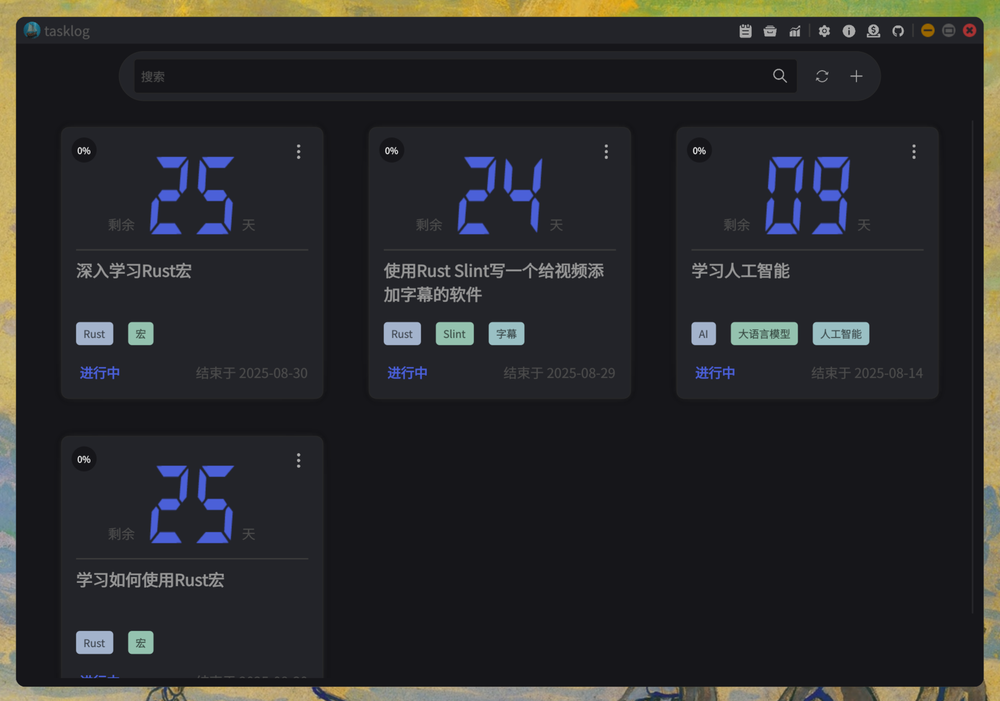

[中文文档](./README.zh-CN.md)

[Introduction Video](https://youtu.be/f_Fq8rE-Ghs)

### Introduction
It's a dead simple task track application.

### Features
- Add, modify, delete, archive, and restore tasks
- Generate task plans using AI
- View task statistics

### How to build?
- Install `Rust` and `Cargo`
- Run `make desktop-debug` to debug desktop application
- Run `make desktop-build-release` to build a release version desktop application
- Refer to [Makefile](./Makefile) for more information

### Troubleshooting
- Using the `Qt backend` can resolve the issue of fuzzy fonts on the Windows platform. It is also recommended to prioritize the `Qt backend` to maintain a consistent build environment with the developers.

### Reference
- [Slint Language Documentation](https://slint-ui.com/releases/1.0.0/docs/slint/)
- [slint::android](https://snapshots.slint.dev/master/docs/rust/slint/android/#building-and-deploying)
- [Running In A Browser Using WebAssembly](https://releases.slint.dev/1.7.0/docs/slint/src/quickstart/running_in_a_browser)
- [github/slint-ui](https://github.com/slint-ui/slint)
- [Viewer for Slint](https://github.com/slint-ui/slint/tree/master/tools/viewer)
- [LSP (Language Server Protocol) Server for Slint](https://github.com/slint-ui/slint/tree/master/tools/lsp)
- [developer.android.com](https://developer.android.com/guide)
- [color4bg](https://www.color4bg.com/zh-hans/)
- [How to Deploy Rust Binaries with GitHub Actions](https://dzfrias.dev/blog/deploy-rust-cross-platform-github-actions/)
